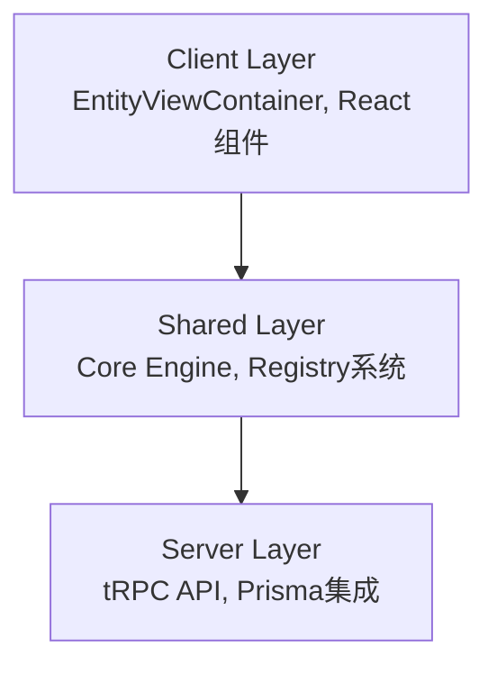

# @scenemesh/entity-engine

> 元数据驱动的实体与视图运行引擎

Entity Engine 是一个创新的元数据驱动框架，专为快速构建现代化企业应用而设计。通过统一的元数据配置，自动生成完整的数据模型、API接口和用户界面。

## 🎯 适用场景

### ✅ 适用于
- **企业管理系统** - CRM、ERP、内容管理等
- **快速原型开发** - 数据驱动的应用快速验证
- **配置化应用** - 需要动态模型定义的系统
- **标准CRUD场景** - 大量表单和列表操作

### ❌ 不适用于
- 高度定制化的UI交互
- 实时性要求极高的应用
- 复杂的数据可视化系统

## 🏗️ 核心架构

### 三层分离设计


- **Client Layer**: EntityViewContainer、React组件
- **Shared Layer**: EntityEngine核心、Registry系统
- **Server Layer**: tRPC路由、Prisma数据访问

## ⚡ 60秒快速体验

### 1. 安装依赖
```bash
npm install @scenemesh/entity-engine
npm install @scenemesh/entity-engine-react
```

### 2. 初始化引擎
```typescript
import { EntityEngine } from '@scenemesh/entity-engine/server';

const engine = await EntityEngine.getInstance({
  // 初始化配置
});
```

### 3. 创建API路由
```typescript
// pages/api/trpc/[trpc].ts
import { appRouter } from '@scenemesh/entity-engine/server';
import { createNextApiHandler } from '@trpc/server/adapters/next';

export default createNextApiHandler({
  router: appRouter,
  // 其他配置...
});
```

### 4. 使用视图容器
```tsx
import { EntityViewContainer } from '@scenemesh/entity-engine';

export default function ProductPage() {
  return (
    <EntityViewContainer 
      modelName="Product" 
      viewType="grid" 
      behavior={{ mode: 'display' }} 
    />
  );
}
```

## 🔧 核心特色

### 🎨 动态模型定义
基于IEntityModel接口的JSON配置，支持复杂字段类型和关系映射：

```typescript
const productModel: IEntityModel = {
  name: 'Product',
  title: '产品',
  fields: [
    {
      name: 'name',
      title: '产品名称',
      type: 'string',
      isRequired: true,
      searchable: true
    },
    {
      name: 'category',
      title: '分类',
      type: 'many_to_one',
      refModel: 'Category'
    }
  ]
};
```

### 🧩 模块化扩展
通过IEntityModule接口实现功能模块的热插拔：

```typescript
const customModule: IEntityModule = {
  info: { name: 'CustomModule', version: '1.0.0' },
  setupConfig: async (engine) => {
    // 注册模型和视图
  },
  setupComponents: async (engine) => {
    // 注册UI组件
  }
};
```

### 🔄 统一DataSource
TRPCEntityObjectDataSource提供统一的数据访问接口：

```typescript
// 自动生成的API端点
await dataSource.findObject({ id: '123', modelName: 'Product' });
await dataSource.listObjects({ modelName: 'Product', pagination: { page: 1 } });
await dataSource.createObject({ modelName: 'Product', values: { name: 'New Product' } });
```

### 🎛️ 字段类型策略
基于IModelFieldTyper的类型系统，支持自定义字段行为：

- **内置类型**: StringFieldTyper、NumberFieldTyper、DateFieldTyper
- **关系类型**: ManyToOneFieldTyper、OneToManyFieldTyper
- **扩展类型**: 自定义Typer实现特殊业务逻辑

### 📊 可插槽视图
支持多种内置视图类型和自定义渲染器：

- **FormView** - 单对象编辑视图
- **GridView** - 列表网格视图  
- **KanbanView** - 看板管理视图
- **DashboardView** - 仪表盘视图

## 🆚 与传统方案对比

| 特性 | Entity Engine | 传统手写CRUD | 低代码平台 |
|------|---------------|-------------|-----------|
| 开发效率 | ⭐⭐⭐⭐⭐ | ⭐⭐ | ⭐⭐⭐⭐ |
| 定制灵活性 | ⭐⭐⭐⭐ | ⭐⭐⭐⭐⭐ | ⭐⭐ |
| 代码可控性 | ⭐⭐⭐⭐⭐ | ⭐⭐⭐⭐⭐ | ⭐⭐ |
| 学习成本 | ⭐⭐⭐ | ⭐⭐ | ⭐⭐⭐⭐ |
| 扩展能力 | ⭐⭐⭐⭐⭐ | ⭐⭐⭐⭐ | ⭐⭐ |

## 🌟 生态模块

### AI Module
智能化的字段推荐和数据处理能力

### Studio
可视化的模型设计和配置界面

### Additions
丰富的业务组件和扩展模块

## 🚀 下一步

立即开始您的Entity Engine之旅：

<div className="mt-6 flex gap-4">
  <a href="/entity-engine/getting-started" className="bg-blue-500 text-white px-4 py-2 rounded hover:bg-blue-600">
    📚 快速开始
  </a>
  <a href="/entity-engine/concepts" className="bg-gray-500 text-white px-4 py-2 rounded hover:bg-gray-600">
    🧠 核心概念
  </a>
  <a href="/entity-engine/api-reference" className="bg-green-500 text-white px-4 py-2 rounded hover:bg-green-600">
    📖 API 参考
  </a>
</div>

---

[](https://www.npmjs.com/package/@scenemesh/entity-engine)
[](https://opensource.org/licenses/MIT)

[💡 贡献指南](https://github.com/scenemesh/entity-engine/blob/main/CONTRIBUTING.md) | [🐛 问题反馈](https://github.com/scenemesh/entity-engine/issues)